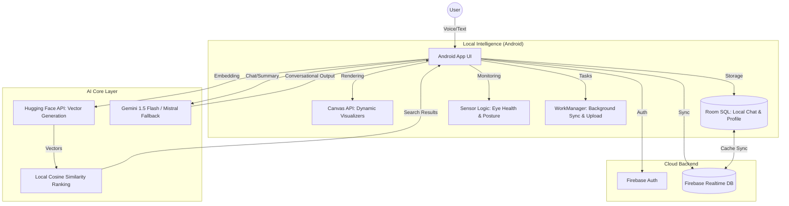

# 📚 BookBuddy: AI-Driven Library Ecosystem

**BookBuddy** is a sophisticated, high-tech Android application designed to transform traditional library management into an intelligent, interactive experience. Built for classroom and institutional use, it leverages cutting-edge Generative AI and Retrieval-Augmented Generation (RAG) to make book discovery and interaction seamless.

---

## 📐 High-Level System Architecture (HLD)

The following diagram illustrates how BookBuddy integrates local mobile features with powerful cloud AI services:



---

## 🚀 Key Intelligent Features

### 1. AI Semantic Search (Beyond Keywords)
Traditional search looks for exact words. BookBuddy understands **meaning**.
- **Vectorization**: Every book is converted into a 384-dimensional mathematical vector using Hugging Face's `all-MiniLM-L6-v2` model.
- **Local-First AI**: To optimize cost and privacy, embeddings are generated and stored **locally** on the device via [BookSyncWorker.kt](file:///d:/bookbuddy/app/src/main/java/com/rajnishkumar/bookbuddy/worker/BookSyncWorker.kt).
- **Conceptual Matching**: Uses **Cosine Similarity** in [AISearchHelper.kt](file:///d:/bookbuddy/app/src/main/java/com/rajnishkumar/bookbuddy/ai/AISearchHelper.kt) to find books with matching themes, even without keyword overlap.

### 2. Vocal Robo Assistant (Voice RAG)
A dedicated hands-free interface for book discovery.
- **Natural Conversation**: Speak naturally to the Robo in [VocalRoboFragment.kt](file:///d:/bookbuddy/app/src/main/java/com/rajnishkumar/bookbuddy/ui/dashboard/VocalRoboFragment.kt). It uses **Mistral-7B** for intent classification and **Gemini** for conversational responses.
- **Vocal Delivery**: Features real-time voice synthesis and synchronized ripple animations via [VoiceRippleView.kt](file:///d:/bookbuddy/app/src/main/java/com/rajnishkumar/bookbuddy/ui/canvas/VoiceRippleView.kt).

### 3. Interactive Book Chat (Real RAG)
Don't just read about a book—talk to it.
- **On-Demand Chunking**: Descriptions are split into relevant sentences only when needed to save memory in [RagService.kt](file:///d:/bookbuddy/app/src/main/java/com/rajnishkumar/bookbuddy/ai/RagService.kt).
- **Contextual Q&A**: Uses a specialized RAG pipeline to answer questions based *only* on the book's context.
- **AI Quizzes**: Generates dynamic multiple-choice questions (MCQs) using [GeminiClient.kt](file:///d:/bookbuddy/app/src/main/java/com/rajnishkumar/bookbuddy/ai/GeminiClient.kt) to test reader comprehension.

### 4. Efficient Bulk Management
Designed for librarians to manage large collections.
- **Smart CSV Upload**: Supports bulk importing thousands of books using [BulkUploadHelper.kt](file:///d:/bookbuddy/app/src/main/java/com/rajnishkumar/bookbuddy/ai/BulkUploadHelper.kt) and [BookUploadWorker.kt](file:///d:/bookbuddy/app/src/main/java/com/rajnishkumar/bookbuddy/worker/BookUploadWorker.kt).
- **Sync Tracker**: Uses a global timestamp on Firebase to trigger automatic data synchronization across all member devices.

### 5. Secure Authentication & UX
Modern, user-friendly security features.
- **Google Sign-In**: One-tap authentication using Android Credential Manager.
- **Self-Service Password Reset**: Secure Firebase-powered "Forgot Password" flow with automated email recovery.
- **Welcome Notifications**: Proactive, high-priority push notifications that greet users upon successful signup or login, providing a warm onboarding experience.

---

## 🎨 Premium UI & Health Integration

- **Custom Canvas Visualizers**: 
    - **Home**: [LibraryCanvasView.kt](file:///d:/bookbuddy/app/src/main/java/com/rajnishkumar/bookbuddy/ui/canvas/LibraryCanvasView.kt) with floating 3D books and shimmering stars.
    - **Analytics**: [GenreBubbleCanvasView.kt](file:///d:/bookbuddy/app/src/main/java/com/rajnishkumar/bookbuddy/ui/canvas/GenreBubbleCanvasView.kt) and [GenreBarGraphView.kt](file:///d:/bookbuddy/app/src/main/java/com/rajnishkumar/bookbuddy/ui/canvas/GenreBarGraphView.kt) for interactive data storytelling.
    - **AI Search**: [AISearchVisualizerView.kt](file:///d:/bookbuddy/app/src/main/java/com/rajnishkumar/bookbuddy/ui/canvas/AISearchVisualizerView.kt) with pulse and node animations.
- **Wellness Sensors (BaseActivity)**: 
    - **Proximity**: Warns if the screen is too close to the eyes via [BaseActivity.kt](file:///d:/bookbuddy/app/src/main/java/com/rajnishkumar/bookbuddy/ui/sensor/BaseActivity.kt).
    - **Accelerometer**: Detects poor reading angles (tilt > 80°) to prevent "tech-neck."
    - **Usage Tracking**: Automatic "Take a Break" alerts after 30 minutes of continuous use via [UsageTracker.kt](file:///d:/bookbuddy/app/src/main/java/com/rajnishkumar/bookbuddy/ui/sensor/UsageTracker.kt).
- **Global Branding**: A consistent primary-colored UI border applied via a custom `BaseActivity` wrapper.

---

## 🛠️ Technical Stack

| Component | Technology |
| :--- | :--- |
| **Language** | Kotlin + Coroutines + KSP |
| **Database** | Firebase Realtime DB + Room SQL |
| **AI Models** | Gemini 1.5 Flash, Mistral-7B (Intent), BART-Large (Summarization) |
| **Embeddings** | all-MiniLM-L6-v2 (Hugging Face Inference) |
| **Vision** | Google ML Kit (Barcode/ISBN) + CameraX |
| **UI Framework** | Material 3 + Custom Canvas API |
| **Background** | WorkManager (Sync & Bulk Upload) |

---

## 📁 Project Structure

- `ai/`: Core logic for [GeminiClient.kt](file:///d:/bookbuddy/app/src/main/java/com/rajnishkumar/bookbuddy/ai/GeminiClient.kt), [HuggingFaceClient.kt](file:///d:/bookbuddy/app/src/main/java/com/rajnishkumar/bookbuddy/ai/HuggingFaceClient.kt), and [AISearchHelper.kt](file:///d:/bookbuddy/app/src/main/java/com/rajnishkumar/bookbuddy/ai/AISearchHelper.kt).
- `database/`: [AppDatabase.kt](file:///d:/bookbuddy/app/src/main/java/com/rajnishkumar/bookbuddy/database/AppDatabase.kt) and DAOs for local caching.
- `models/`: Unified data models like [Book.kt](file:///d:/bookbuddy/app/src/main/java/com/rajnishkumar/bookbuddy/models/Book.kt) and [QuizModels.kt](file:///d:/bookbuddy/app/src/main/java/com/rajnishkumar/bookbuddy/models/QuizModels.kt).
- `ui/canvas/`: High-performance custom views for animations and charts.
- `ui/sensor/`: [BaseActivity.kt](file:///d:/bookbuddy/app/src/main/java/com/rajnishkumar/bookbuddy/ui/sensor/BaseActivity.kt) and [UsageTracker.kt](file:///d:/bookbuddy/app/src/main/java/com/rajnishkumar/bookbuddy/ui/sensor/UsageTracker.kt) for health-centric features.
- `worker/`: Background processing for data synchronization.

---

## ⚙️ Developer Setup

To get BookBuddy running locally, follow these steps:

### 1. Prerequisites
- Android Studio Ladybug or newer.
- A Firebase project with **Realtime Database** and **Auth** enabled.
- API keys for **Google Gemini** and **Hugging Face**.

### 2. Configuration
1. **Firebase**: Add your `google-services.json` to the `app/` directory.
2. **API Keys**: Open [Constants.kt](file:///d:/bookbuddy/app/src/main/java/com/rajnishkumar/bookbuddy/common/Constants.kt) and update:
   ```kotlin
   const val HUGGINGFACE_TOKEN = "xxxxxxxxxxxxxxxxxxxxxxxxxxxxxx"
   const val GEMINI_API_KEY = "xxxxxxxxxxxxxxxxxxxxxxxxxxxxxx"
   ```
3. **Database Rules**: Ensure Firebase rules allow authenticated read/write.
4. **Google Sign-In**: 
   - Enable **Google** as a Sign-in provider in the Firebase Console.
   - Add your **SHA-1** fingerprint to the project settings.
   - Configure the **OAuth Consent Screen** in the [Google Cloud Console](https://console.cloud.google.com/apis/credentials/consent). You only need to provide an "App name", "User support email", and "Developer contact info".
   - Download the updated `google-services.json` and place it in the `app/` directory.

### 3. Build & Run
- Sync Gradle and run on API 24+.
- Includes full support for **16KB page sizes** (Android 15+).

---

## 🤝 Contributing

Contributions are welcome! Please fork, create a feature branch, and open a Pull Request.

---

## 📄 License

MIT License - see the LICENSE file for details.
